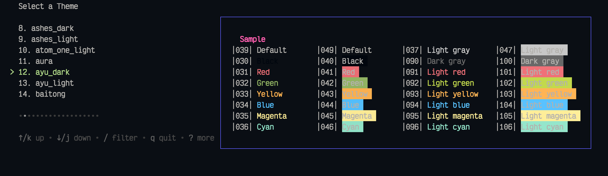

# Goalacritty theme changer

## Introduction
This is a simple application for alacritty terminal themes installation and selection written for MacOS.


## Prerequisits
We require `git`, `alacritty` and `go`.
All of the above can be installed using `brew` by running
```bash
brew install git 
brew install alacritty 
brew install go
```
## Running
Once you are ready, type
```bash
go run main.go
```
The app will clone `alacritty-theme` repository (see `config.toml` for details) and edit your `alacritty.toml` config file.
